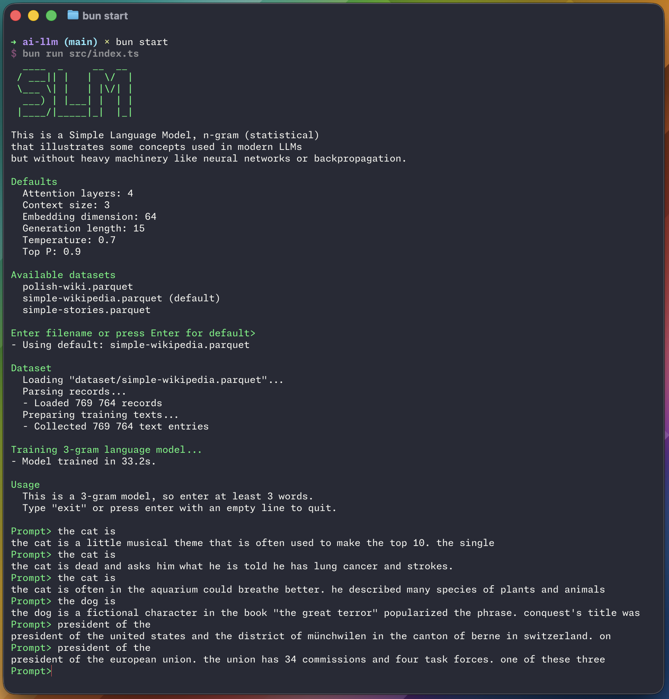

# Simple LLM

This project was written as a hands-on learning exercise to understand how language models work by building one from scratch.

It is a simple n-gram (statistical) language model that illustrates some concepts used in modern LLMs, but without heavy machinery like neural networks or backpropagation.

Written in plain TypeScript with no machine learning libraries, walking through each step of next-word prediction.

Inspiration: ["How LLMs Actually Generate Text" by LearnThatStack](https://www.youtube.com/watch?v=NKnZYvZA7w4).

## Preview

  

## Usage

Requirements:

- [Bun](https://bun.sh/)

Scripts:

- `bun i` to install dependencies
- `bun start` to start app
- `bun lint` to lint code with ESLint
- `bun typecheck` to check TypeScript types
- `bun test` to run all tests

## Structure

- [`dataset/`](./dataset/) contains [rahular/simple-wikipedia](https://huggingface.co/datasets/rahular/simple-wikipedia) data in Parquet format. It consists of 87 MB with 770k rows of text from English Wikipedia.

- [`docs/`](./docs/) contains documentation and images

- [`src/`](./src/):
  - [`attention.ts`](./src/attention.ts) - self-attention mechanism
  - [`defaults.ts`](./src/defaults.ts) – default configuration values
  - [`context.ts`](./src/context.ts) – context windows (n-grams)
  - [`dataset/`](./src/dataset/) – dataset loading and text extraction
  - [`embeddings.ts`](./src/embeddings.ts) – tokens -> vectors in semantic space
  - [`index.ts`](./src/index.ts) – training + cli
  - [`llm.ts`](./src/llm.ts) – combines all components into the LLM
  - [`model.ts`](./src/model.ts) – statistical language model + sampling with temperature and Top P
  - [`tokenizer.ts`](./src/tokenizer.ts) – text -> tokens
  - [`vocabulary.ts`](./src/vocabulary.ts) – word <-> number mapping (token IDs)

- [`tests/`](./tests/) contains unit and integration tests.

## Algorithm

### Step 1. Tokenization

- Converts text into tokens (word -> unique number ID)
- File: `tokenizer.ts`, `vocabulary.ts`
- [Wikipedia: Tokenization](https://en.wikipedia.org/wiki/Large_language_model#Tokenization)

### Step 2. Embeddings

- Converts token IDs into vectors (lists of numbers) where similar words are positioned close together in semantic space
- **Note: Real LLMs learn embeddings through training. We initialize randomly.**
- File: `embeddings.ts`
- [Wikipedia: Word Embedding](https://en.wikipedia.org/wiki/Word_embedding)

### Step 3. Attention Mechanism

- Helps the model understand relationships between tokens by computing attention scores across the context
- **Note: Attention is used here purely for illustrative purposes—it demonstrates how the mechanism could work, but without a neural network it cannot be used for prediction.**
- File: `attention.ts`
- [Wikipedia: Attention](<https://en.wikipedia.org/wiki/Attention_(machine_learning)>)

### Step 4. Probability Distribution

- Counts how often each word follows a given context and converts those counts into probabilities
- File: `model.ts`
- [Wikipedia: Probability Distribution](https://en.wikipedia.org/wiki/Probability_distribution)

### Step 5. Sampling

- Temperature: Controls randomness
  - `T < 1`: more deterministic (precision)
  - `T = 1`: proportional to probability
  - `T > 1`: more random (creativity)
- Top P (Nucleus Sampling): Only considers the most likely tokens whose combined probability reaches P, balancing diversity and quality
- File: `model.ts`
- [Wikipedia: Top-p Sampling](https://en.wikipedia.org/wiki/Top-p_sampling)

## Configuration

Defaults from `defaults.ts`:

- `DEFAULT_ATTENTION_LAYERS`: Number of attention layers
- `DEFAULT_CONTEXT_SIZE`: N-gram size (how many words as context)
- `DEFAULT_EMBEDDING_DIMENSION`: Size of embedding vectors
- `DEFAULT_GENERATION_LENGTH`: Number of tokens to generate
- `DEFAULT_TEMPERATURE`: Sampling randomness
- `DEFAULT_TOP_P`: Nucleus sampling threshold
